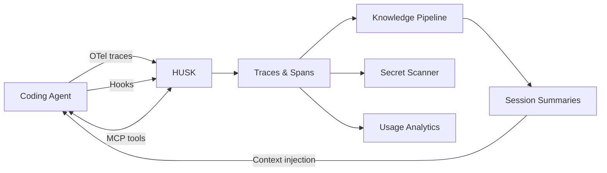
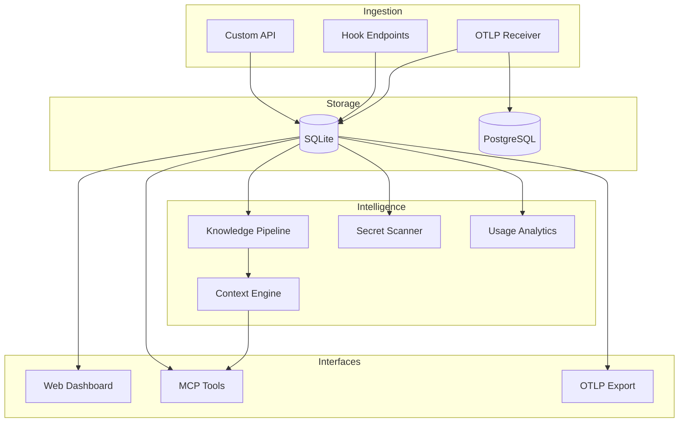

# HUSK

OTel-native observability and context engineering for AI coding agents.

Collects traces from Claude Code (and other agents), stores them as OTel spans, runs trufflehog against the trace data to find leaked secrets, breaks down cost and token usage per model, and compresses sessions into knowledge that gets injected into future sessions via MCP. You can look up what happened in any session through the web UI. The agent can query its own history whenever it needs to.

## How it works



HUSK receives telemetry, stores it as OTel-shaped traces and spans, then runs three pipelines: knowledge derivation (compress sessions into searchable memories), secret scanning (flag leaked credentials via trufflehog), and usage analytics (cost, tokens, model comparison).



## Quick start

```bash
git clone https://github.com/Saturate/HUSK.git
cd HUSK && bun install

# Fully local, no Docker, no external services:
HUSK_EMBEDDINGS=transformers HUSK_STORAGE=sqlite-vec bun run server/src/index.ts
```

Open `http://localhost:3000/setup` to create your admin account.

### Connect Claude Code

HUSK accepts Claude Code's native OTel telemetry. Add to your Claude Code `settings.json`:

```json
{
  "env": {
    "CLAUDE_CODE_ENABLE_TELEMETRY": "1",
    "OTEL_EXPORTER_OTLP_ENDPOINT": "http://localhost:3000",
    "OTEL_EXPORTER_OTLP_PROTOCOL": "http/protobuf"
  }
}
```

Or route through Grafana Alloy for fan-out to multiple backends (HUSK + Grafana + Datadog + whatever speaks OTLP).

For MCP tools (search memories, query traces, compress sessions), add to `.mcp.json`:

```json
{
  "mcpServers": {
    "husk": {
      "type": "http",
      "url": "http://localhost:3000/mcp",
      "headers": { "Authorization": "Bearer husk_your-key" }
    }
  }
}
```

## What you get

**Dashboard** with cost cards, daily spend chart, project breakdown, model comparison.

**Session tracing** with filterable trace list and a span detail viewer showing every turn, tool call, and subagent in a session.

**Model analytics** comparing token output per turn, cost per turn, and cache hit rates across model families. (Opus 4.8 outputs 3x more tokens per turn than 4.6. The data makes this visible.)

**Secret scanning** powered by trufflehog. Scans trace data for leaked credentials that were exposed to the model provider through tool calls. Found real verified Storyblok and AbuseIPDB key leaks in historical sessions.

**Knowledge derivation** from telemetry. Sessions get compressed into structured summaries (what was asked, what was done, what was learned, what's next) and stored as searchable memories.

**MCP tools** the agent can use mid-session: `cost_summary`, `tool_stats`, `get_trace_summary`, `get_trace_spans`, `compress_trace`, `scan_secrets`, `project_insights`.

## Architecture

Everything is pluggable via a provider pattern:

| Layer | Options |
|---|---|
| **Telemetry storage** | SQLite (default), PostgreSQL |
| **Telemetry source** | OTLP receiver, custom API, legacy hooks |
| **Embeddings** | Ollama, Transformers.js (local), OpenAI, Voyage, llama.cpp |
| **Vector store** | Qdrant, SQLite-vec (local) |
| **Compression** | Anthropic, OpenRouter, Ollama |
| **Graph** | SQLite, Neo4j |
| **OTLP export** | Optional dual-write to any OTLP backend |

Three deployment modes:

**Standalone** (local SQLite, zero config) - install, run, point Claude Code at it.

**Fan-out target** (behind Alloy) - HUSK is one OTLP destination alongside Grafana, Datadog, whatever.

**Grafana-backed** (future) - HUSK reads traces from Tempo, owns only the knowledge layer.

## Configuration

Environment variables or `husk.toml`. Env vars take priority.

| Variable | Default | What it does |
|---|---|---|
| `HUSK_TELEMETRY` | `sqlite` | Telemetry backend (`sqlite`, `postgres`, `otlp`) |
| `HUSK_TELEMETRY_URL` | - | PostgreSQL connection string |
| `HUSK_OTLP_AUTH` | `true` | Set `false` for local-only OTLP without auth |
| `HUSK_STORAGE` | `qdrant` | Vector backend (`qdrant`, `sqlite-vec`) |
| `HUSK_EMBEDDINGS` | `ollama` | Embedding backend (`ollama`, `transformers`, `openai`, `voyage`) |
| `HUSK_COMPRESSION_MODE` | `client` | `client` (agent compresses) or `server` (auto) |
| `HUSK_PORT` | `3000` | Server port |

## Development

```bash
bun install
cd server && bun run dev     # hot reload
cd server && bun test        # 312 tests
cd server && bun run check   # lint + format
cd server && bun run build:ui  # rebuild frontend
```

## License

MIT
